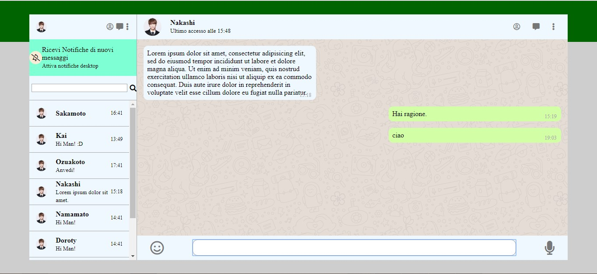
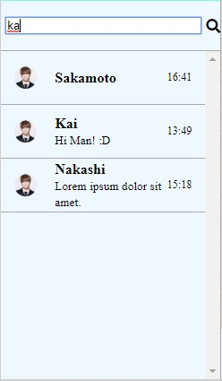

# boolzapp : Clone di Whatsapp Web

# Obiettivo:
Creare un clone di Whatsapp web usando #JQuery , HTML , CSS

# Utilizzo:
Lo user può vedere tutte le varie conversazioni e cliccare per vedere i dettagli.
Inoltre l'utente può cercare una conversazione con una specifica persona utilizzando la barra di ricerca.

# Auto-message
Si può mandare un messaggio a uno qualunque dei contatti e riceveremo una risposta standard automatizzata dal contatto a cui stiamo "scrivendo"

# Screenshot

